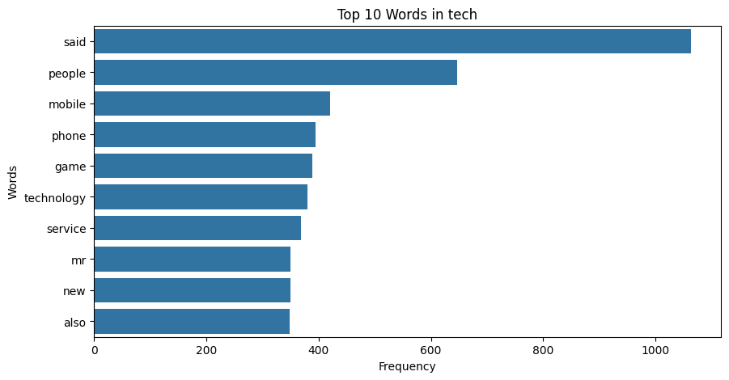

# ML-News-Classification

## [LINK TO PROJECT CODE](project.ipynb)

## Table of Contents
1. 👋🏽 [Introduction](#-introduction)
2. 🎯 [Objectives](#-objectives)
3. 🧭  [Exploratory Data Analysis](#exploratory-data-analysis)
4. 🔨 [Model Development](#model-development)
5. 📖 [Supervised Learning Comparison](#supervised-learning-comparison)
7. [References](#references) 

## 👋🏽 Introduction 
In the information age, effectively categorizing news articles is essential for managing the vast amounts of daily content. This project uses machine learning techniques to classify news articles into predefined categories. We aim to develop a robust classification system using the BBC news dataset, which includes articles spanning business, entertainment, politics, sports, and technology. This endeavour will enhance our understanding of natural language processing (NLP) and improve our ability to manage and interpret large text corpora efficiently.

## 🎯 Objectives
The primary objective of this project is to build a machine-learning model capable of accurately classifying BBC news articles into one of five categories: business, entertainment, politics, sport, and tech. To achieve this goal, we will utilize matrix factorization techniques, specifically non-negative matrix factorization (NMF). Additionally, we will compare the performance of this method against traditional supervised learning approaches.

## 🧭 Exploratory Data Analysis

We analyzed the BBC News dataset and created visualizations to establish a solid basis for model development. First, we loaded the training and testing datasets and then conducted a comprehensive text-cleaning process. This process involved tokenizing the text, removing stop words and punctuation, converting text to lowercase, and lemmatizing words to their base forms. We did this to ensure that the text data was uniform and free from unnecessary noise. Additionally, when cleaning the data we found no duplicates or missing values, which indicated that the dataset was well-structured and ready for analysis.

Next, we performed a detailed word frequency analysis for each news category, identifying the top 10 most commonly used words. This analysis provided insights into the vocabulary distribution within different categories, which was crucial for understanding the dataset's characteristics.

```
Category: business
[('said', 1100), ('year', 574), ('u', 512), ('mr', 394), ('company', 392), ('firm', 374), ('market', 340), ('would', 308), ('also', 279), ('sale', 276)]


Category: tech
[('said', 1064), ('people', 646), ('mobile', 420), ('phone', 394), ('game', 388), ('technology', 380), ('service', 369), ('mr', 350), ('new', 349), ('also', 348)]


Category: politics
[('said', 1445), ('mr', 1099), ('would', 710), ('labour', 488), ('government', 469), ('party', 450), ('election', 448), ('blair', 391), ('people', 372), ('minister', 371)]


Category: sport
[('said', 635), ('game', 481), ('win', 334), ('england', 327), ('first', 323), ('player', 308), ('year', 296), ('world', 266), ('time', 262), ('last', 255)]


Category: entertainment
[('film', 691), ('said', 594), ('best', 404), ('year', 392), ('award', 329), ('also', 277), ('show', 271), ('one', 267), ('u', 262), ('music', 255)]
```
To visually represent these findings, we created a bar graph displaying each category's top words. This visualization highlighted the frequency and prominence of specific words within each category, clearly comparing word usage patterns.





In addition, we generated a comprehensive word cloud covering the entire dataset, presenting a visually intuitive representation of the most frequent words. This word cloud facilitated an immediate understanding of the dominant terms used across all news articles. The combination of these visualizations provided a holistic view of the dataset, revealing essential patterns and trends in word usage.


Overall, this EDA process cleaned and prepared the data and provided critical insights through visualizations, setting a solid foundation for the subsequent model-building and evaluation phases. 

## 🔨 Model Development
We employed TF-IDF vectorization to convert textual data into numerical form. This transformation captured the importance of words across documents while mitigating the influence of common terms. We opted for a vocabulary size of 5000 words, a balance between capturing sufficient information and avoiding excessive computational complexity. We also excluded common English stop words to enhance model performance, as these words often carry little semantic meaning and can introduce noise into the model's representation of the text.

For the matrix factorization, we applied Non-Negative Matrix Factorization (NMF), specifying 20 components as our initial parameter. This method decomposes the TF-IDF matrix into topic distributions for each document, effectively summarizing the text data into meaningful features. The resulting matrices for train and test sets (W_train and W_test) served as the input for our supervised learning model.

We then encoded the categorical labels from the training set and trained a Logistic Regression model on the NMF-transformed data. This supervised model was chosen for its efficiency and effectiveness in handling multi-class classification problems. After fitting the model, we predicted labels for both train and test sets. To map the predicted test labels back to their original categories, we used a combination of the original category labels and the predicted probabilities from the model. This process ensures that the predicted labels are consistent with the original labelling scheme, enhancing the interpretability of the model's output.

To evaluate our model's performance, we calculated the accuracy on the training data and visualized the confusion matrix, which highlighted the model's prediction strengths and areas for improvement. The initial results provided a baseline for further refinement.


We explored hyperparameter tuning by varying the number of components in the NMF model and evaluating the impact on training accuracy. This iterative process involved testing component values ranging from 1 to 50 and plotting the results to identify the optimal number of topics that balance model complexity and accuracy. 


## 📖 Supervised Learning Comparison
We compared the performance of a supervised learning method, Logistic Regression, against an unsupervised learning method, Non-negative Matrix Factorization (NMF), for text classification on the BBC News dataset. Our primary goal was to assess these approaches' effectiveness and data efficiency.

We trained a Logistic Regression model on this dataset and evaluated its performance. The Logistic Regression model not only achieved a high train accuracy of 99.73%, as evidenced by the minimal misclassifications in the confusion matrix but also maintained near-perfect accuracy even with smaller subsets of the data. This robust performance across different training data sizes instills confidence in the model's data efficiency and robustness.


In contrast, the unsupervised approach involved transforming the same TF-IDF features using NMF with varying numbers of components (ranging from 1 to 50). The NMF model's train accuracy improved with the number of components, peaking at around 20 with an accuracy exceeding 90%. However, it achieved a different level of accuracy than the supervised approach. The accuracy plateaued with more components, suggesting potential overfitting at higher component counts.


Logistic Regression demonstrated superior data efficiency and simpler implementation compared to NMF. It consistently delivered high accuracy across different training data sizes with minimal overfitting, making it more effective for text classification in this context. However, it is essential to note that NMF. At the same time, it may not have matched the performance of the supervised method in this specific task, but it still holds promise for dimensionality reduction and feature extraction in unsupervised settings. 

## References

Bose, B. (2019). BBC News Classification. Kaggle. Retrieved from https://kaggle.com/competitions/learn-ai-bbc

Google Cloud. (2019). Problem-solving with ML: Automatic document classification. Google Cloud Blog. Retrieved from https://cloud.google.com/blog/products/gcp/problem-solving-with-ml-automatic-document-classification

Golden, O. (2019). MovieLens 1M Dataset. Kaggle. Retrieved from https://www.kaggle.com/datasets/odedgolden/movielens-1m-dataset
